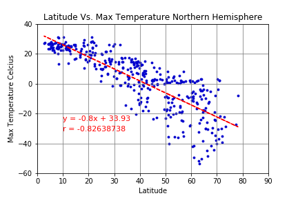

# Weather analysis & Vacation

## Weather

In notebook `weatherpy.ipynb`  I analysed 642 cities around the globe and found weather data for 599 of those. 
I looked at maximum temperatures, humidity, cloudiness and wind speed.
There is a strong negative correlation (✨r value -0.82 ✨) between latitude and maximum temperature in the northern hemisphere. Other observations are:

Weak correlations
- Latitude versus maximum temperature southern hemisphere
- Latitude versus humidity and coudiness both northern and outhern hemisphere

Very weak correlations
- Latitude versus wind speed both northern and outhern hemisphere
## 

## Vacation

In notebook `vacationpy.ipynb` I use input variables for:

- The users current location
-  ✨Maximum km the user wants to travel ✨
- Minimum and maximum temperatures

The output is both a list of locations and hotels as well as a interactive map that shows the ideal locations with addtional information such as hotel name when one hovers over the point.

## 

